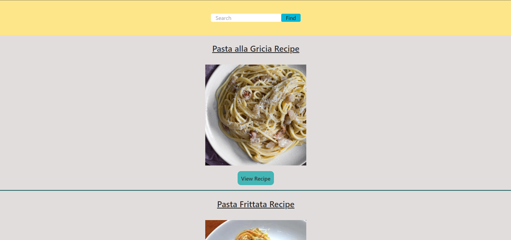

# README Recipe Finder

## Description

When we were brainstorming as a team, we were trying to solve a common problem someone might have. As we were doing so we came up with a couple different ideas, those being a video game website that used Steam's API, a cooking website, and a gardening website. We finally decided to go with the cooking website which we would call recipe finder, the website would allow the user to find different recipes to make the perfect dinner dishes to serve to the user's family. In working as a team we established a workflow where we would meet up on google team meetings in addition to the time we had together in class. We created our own branch with our name to keep organized, so that we can push into our respective branch and then create a pull request from our branch into the develop branch. Our develop branch is where we can test code and merge all of our branches into. Once we have the develop branch working the way we want it to then we can create a pull request from develop into main.

## Technologies Used

* First Server-Side API: https://developer.edamam.com/edamam-docs-recipe-api
* Second Server-Side API: https://www.wordsapi.com
* CSS Framework: https://tailwindcss.com/
* jQuery
* jQuery UI

## Work Roles 

Jacob Pubwill: HTML Results page/Words API 

Jennifer Arevalo: HTML CSS For Homepage and Results page

Roy Hubbard: Javascript Food API

William Graves: Javascript local storage

## User Story:

AS A mom, I want to be able to easily find a recipe for dinner, SO that I can spend less time thinking about what to cook and spend more time with my family.

## Acceptance Criteria

* It’s done when I arrive at the home page and I am able to search foods and it’s able to give different food options

* It’s done when the user hits search they are given a list of food options

* It’s done when the options appear and are automatically styled on page load

* It’s done when the UI is fully finished and polished

* It’s done when there is autocomplete for the words when the user starts typing

## Screenshots

## Link to Deployed Application

https://arevalo00.github.io/recipeFinder/
